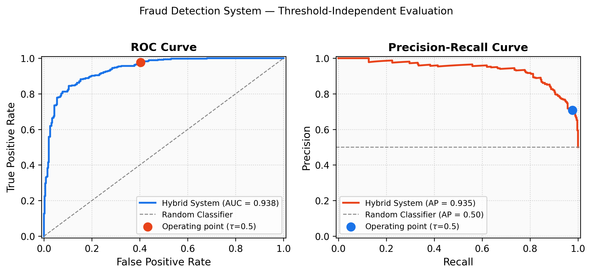

# 🧾 Fraud Bill Detection
### EfficientNet-B0 + OCR Multi-Modal Validation

<p align="center">
  
  
  
  
  
  
</p>

> A hybrid fraud-bill detector combining **EfficientNet-B0 visual classification** and **OCR-based semantic validation** to detect manipulated or counterfeit receipts — achieving a fraud recall of **98%** and ROC AUC of **0.938**.

---

## 📑 Table of Contents
- [Overview](#-overview)
- [How It Works](#%EF%B8%8F-how-it-works)
- [Results](#-results)
- [Dataset](#-dataset)
- [Folder Structure](#-folder-structure)
- [Installation](#%EF%B8%8F-installation)
- [Usage](#-usage)
- [Next Steps](#-next-steps)

---

## 📌 Overview

Financial document fraud is a growing problem across banking, healthcare, retail, and enterprise expense management. This project proposes a **two-branch pipeline** that catches fraud from two independent angles:

| Branch | What it Detects |
|--------|----------------|
| 🖼️ **Image Branch** (EfficientNet-B0) | Visual anomalies — font inconsistencies, logo distortion, compression artefacts from editing |
| 📝 **OCR Branch** (Tesseract + Regex) | Semantic inconsistencies — missing/malformed amounts, GST numbers, transaction IDs, dates |

Neither branch alone is sufficient — a visually intact bill can have doctored fields, and a bill with valid fields can still show visual manipulation. **Fusion addresses both failure modes simultaneously.**

---

## ⚙️ How It Works

### System Pipeline

```
                        Input Bill Image
                               │
                               ▼
               ┌─── Preprocessing (224×224) ───┐
               │    ImageNet Normalisation      │
               └───────────────────────────────┘
                               │
               ┌───────────────┴───────────────┐
               ▼                               ▼
   ┌─────────────────────┐       ┌─────────────────────────┐
   │   BRANCH A          │       │   BRANCH B              │
   │   EfficientNet-B0   │       │   OCR + Regex Validator │
   │                     │       │                         │
   │  Stage 1: Pretrain  │       │  Extract text via OCR   │
   │  Stage 2: Fine-tune │       │  Regex match:           │
   │  Unfreeze last 3    │       │   • Amount              │
   │  blocks             │       │   • GST Number          │
   │  Class-weighted     │       │   • Transaction ID      │
   │  loss               │       │   • Date                │
   │                     │       │                         │
   │  s_img ∈ [0,1]      │       │  s_ocr = matched/4      │
   └────────┬────────────┘       └────────────┬────────────┘
            │                                 │
            └──────────────┬──────────────────┘
                           ▼
               ┌───────────────────────┐
               │     Score Fusion      │
               │                       │
               │  S = 0.7 × s_img      │
               │    + 0.3 × (1−s_ocr)  │
               └───────────┬───────────┘
                           │
                           ▼
               ┌───────────────────────┐
               │  Threshold Decision   │
               │  τ = 0.5 (eval)       │
               │  τ = 0.65 (API)       │
               └───────────┬───────────┘
                           │
                           ▼
               ┌───────────────────────┐
               │  Output: REAL / FAKE  │
               │  + OCR Field Report   │
               └───────────────────────┘
```

### Two-Stage Transfer Learning

```
Stage 1 ──► Pretrain on CG1050 dataset
            (Classifier head only — learn general bill features)
                           │
                           ▼
Stage 2 ──► Fine-tune on receipts dataset
            (Unfreeze last 3 EfficientNet blocks + head)
            (Class-weighted loss to boost fake recall)
```

### Fusion Formula

```
combined_fraud_score = 0.7 × img_fake_score + 0.3 × (1 − ocr_score)

If combined_fraud_score > τ  →  FAKE
Else                         →  REAL
```

The **70/30 weighting** prioritises visual signals while letting OCR provide a meaningful correction — a bill missing all four key fields gets pushed toward fraud even if the image looks clean.

---

## 📈 Results

### Evaluation Curves

Threshold-independent performance on the held-out test set (694 samples, balanced).
The **red dot** marks the operating point at τ = 0.5.



| Metric | Value |
|--------|-------|
| 🟣 **ROC AUC** | **0.938** |
| 🟠 **PR AUC (Average Precision)** | **0.935** |
| Random Classifier Baseline | 0.500 |

> **What this means:** A ROC AUC of 0.938 confirms the model strongly separates real from fake bills at *any* threshold. A PR AUC of 0.935 vs. a 0.50 random baseline means the high false-positive rate at τ = 0.5 is a **deliberate threshold choice**, not a fundamental model weakness — shift τ upward to trade recall for precision along the PR curve.

---

### Classification Report

Evaluated at threshold τ = 0.5 on 694 test samples (347 real, 347 fake):

| Class | Precision | Recall | F1-Score | Support |
|-------|-----------|--------|----------|---------|
| **Fake** | 0.71 | **0.98** ✅ | 0.82 | 347 |
| **Real** | 0.96 | 0.60 | 0.74 | 347 |
| Macro Avg | 0.84 | 0.79 | 0.78 | 694 |
| **Accuracy** | | | **0.79** | 694 |

---

### Confusion Matrix

|  | Predicted Fake | Predicted Real |
|--|:--------------:|:--------------:|
| **Actual Fake** | **339** ✅ TP | 8 ❌ FN |
| **Actual Real** | 140 ⚠️ FP | **207** ✅ TN |

---

### Interpretation

- ✅ **Fake recall = 0.98** — only 8 out of 347 fraudulent bills slip through undetected. In fraud detection, a missed fake is far costlier than a false alarm.
- ⚠️ **Real recall = 0.60** — 140 genuine bills are over-flagged. This is an intentional consequence of class-weighted loss and the 70/30 fusion weight, both designed to minimise missed fraud.
- 🎯 **ROC AUC = 0.938** — the model is inherently strong; threshold tuning via `threshold.py` can shift the operating point to suit different deployment requirements (stricter for banking, looser for retail).

---

## 📊 Dataset

| Source | Purpose | Notes |
|--------|---------|-------|
| [CG1050 Dataset](https://www.kaggle.com/datasets/cg1050) | Stage-1 pretraining | Generic image classification for transfer learning |
| [Synthetic Receipts Dataset](https://www.kaggle.com/datasets/ankurzing/synthetic-receipts-dataset) | Stage-2 fine-tuning | Authentic receipts for training and validation |
| `tamper_with_ocr.py` output | Fake bill generation | Programmatically edits amounts, GST, dates in real receipts |

| Split | Real | Fake | Total |
|-------|------|------|-------|
| Train | ~600 | ~600 | ~1200 |
| Test  | 347  | 347  | 694   |

---

## 📂 Folder Structure

```
Fraud_bill_detection/
│
├── assets
│   ├── curves.png
│ 
├── dataset/
│   ├── train/
│   │   ├── real/
│   │   └── fake/
│   ├── val/
│   │   ├── real/
│   │   └── fake/
│   └── test/
│       ├── real/
│       └── fake/
│
├── dataset_cg1050/
│   └── train/
│       ├── real/
│       └── fake/               # Stage-1 pretraining dataset
│
├── models/
│   ├── fraud_detector.pth      # Trained model weights
│   └── classes.json            # {"fake": 0, "real": 1}
│
├── results/
│   ├── ocr_test_results.csv    # Per-image scores and OCR fields
│   └── curves.png              # ROC + PR evaluation curves  ← add this file here
│
├── scripts/
│   ├── two_stage_train.py      # Two-stage training pipeline
│   ├── patched_pipeline.py     # Offline evaluation (image + OCR fusion)
│   ├── threshold.py            # Threshold sweep and tuning
│   ├── tamper_with_ocr.py      # Generates fake bills by editing OCR fields
│   └── split_val.py            # Splits train into validation
│
├── tampering_log.csv           # Log of edits for synthetic fake receipts
├── tampering_log_test.csv      # Log for test tampering run
├── requirements.txt
└── README.md
```

> 📌 **Important:** Place `curves.png` inside the `results/` folder so the image renders correctly in this README.

---

## 🛠️ Installation

```bash
git clone https://github.com/Adityarajj23/Fraud_bill_detection.git
cd Fraud_bill_detection
pip install -r requirements.txt
```

**Key dependencies:** `torch`, `torchvision`, `pytesseract`, `Pillow`, `scikit-learn`, `pandas`, `opencv-python`, `matplotlib`

---

## ▶️ Usage

### 1. Generate Synthetic Fake Receipts
```bash
python scripts/tamper_with_ocr.py
```
Edits OCR-detected fields (amounts, GST numbers, dates) in real receipts to produce realistic fake samples.

### 2. Prepare Train / Val Split
```bash
python scripts/split_val.py
```

### 3. Train the Model (Two-Stage)
```bash
python scripts/two_stage_train.py
```
- **Stage 1:** Pretrain on CG1050 (classifier head only)
- **Stage 2:** Fine-tune on receipts dataset (last 3 EfficientNet blocks + head unfrozen, class-weighted loss)

### 4. Evaluate with Image + OCR Fusion
```bash
python scripts/patched_pipeline.py
```
Outputs classification report, confusion matrix, and saves per-image scores to `results/ocr_test_results.csv`.

### 5. Tune Decision Threshold
```bash
python scripts/threshold.py
```
Sweeps thresholds and shows the precision/recall tradeoff — use this to find the optimal τ for your deployment context.

---

## 🔮 Next Steps

- [ ] **Grad-CAM visualisations** — highlight manipulated regions within flagged receipts for explainability
- [ ] **Multilingual receipts** — expand dataset to improve generalisation across languages and formats
- [ ] **Baseline benchmarking** — compare against ResNet-50, MobileNet, and ViT classifiers
- [ ] **Threshold auto-tuning** — integrate F-beta optimisation directly into the training loop
- [ ] **FastAPI deployment** — wrap inference as a REST endpoint for production use

---

## 📜 License

This project is licensed under the MIT License. See [LICENSE](LICENSE) for details.
